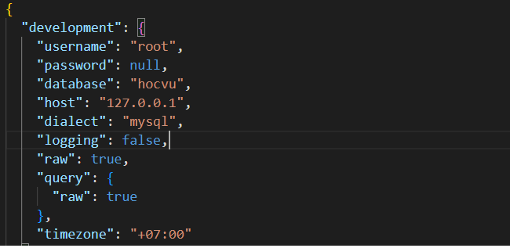
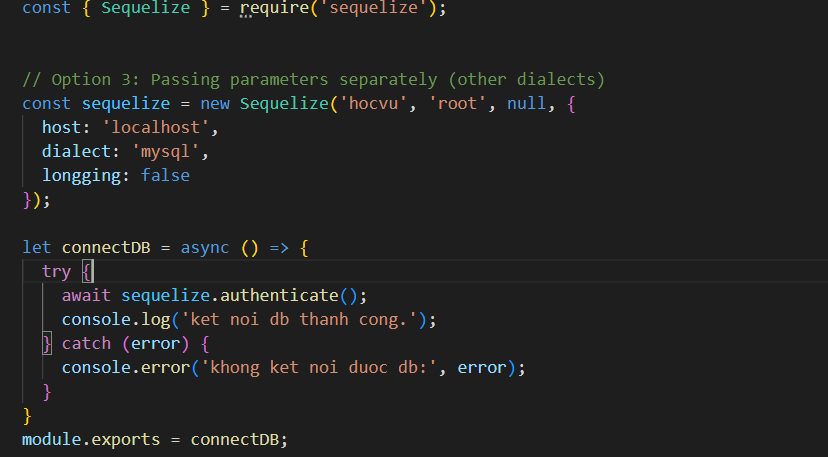

# About
## Website quản lý phòng khám , các chuyên khoa, bác sĩ

KẾT NỐI BACKEND VỚI DATABASE:

Trong file **config.json** : phần sẽ sử dụng là ở development , chỉnh sửa phần database muốn chọn
(ở đây ví dụ lựa chọn db name hocvu) 

đồng thời sử dụng áp đặt sequelize để kết nối db (chỉnh ở trang **connectDB.js** )

HOÀN THÀNH KÊT NỐI XONG thực hiện khởi tạo các bảng sử dụng lệnh terminal : 
-npx sequelize-cli db:migrate